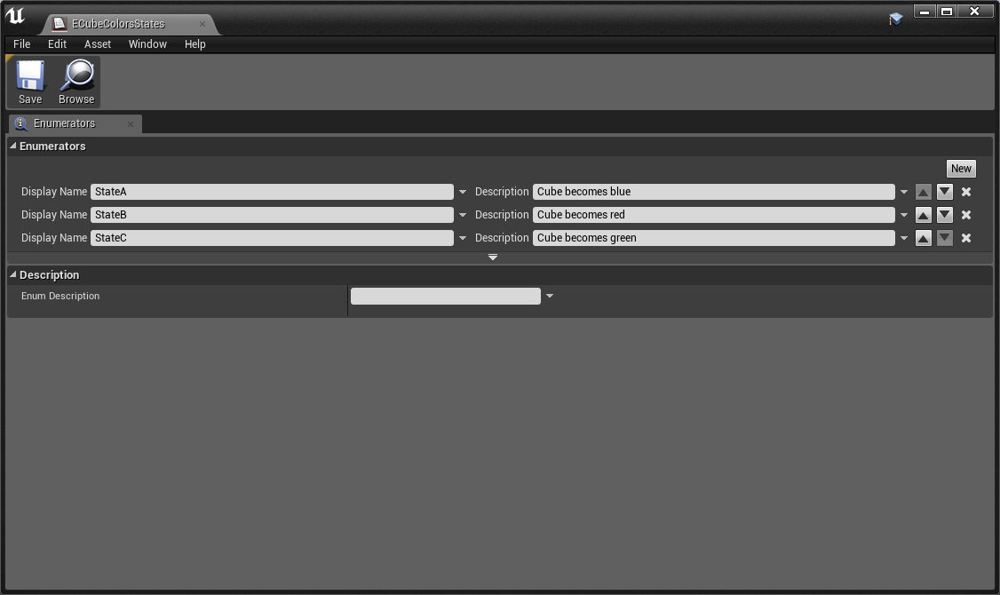
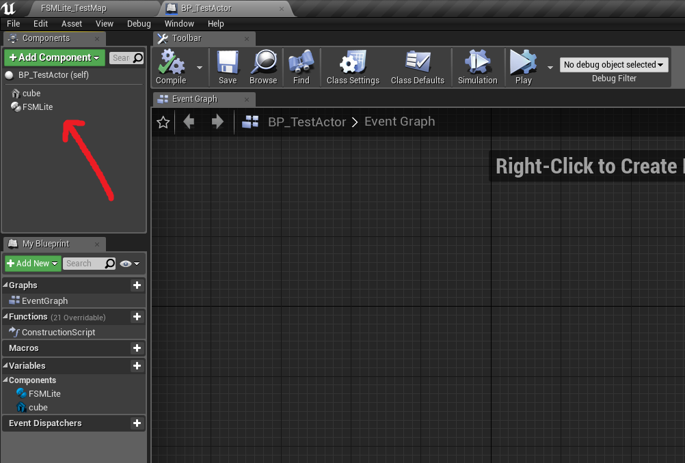
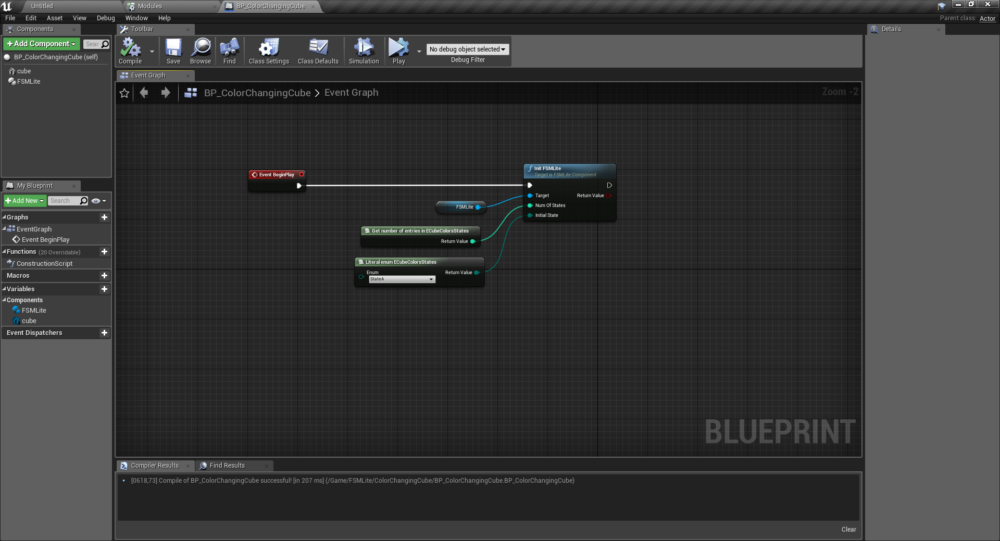
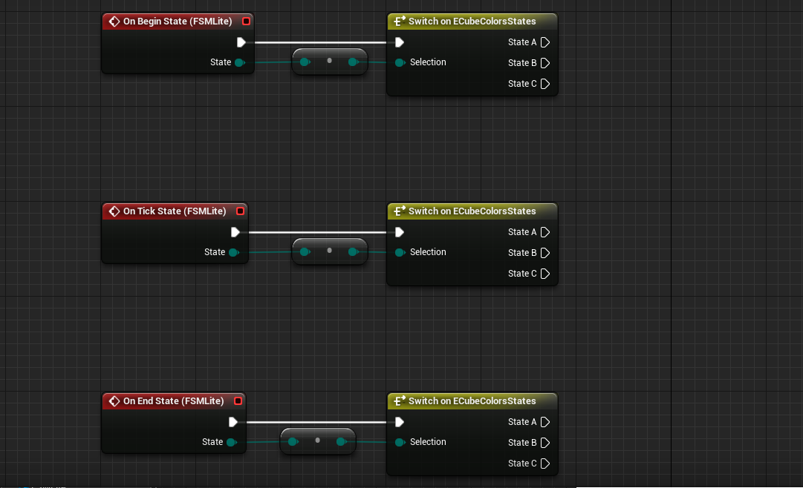
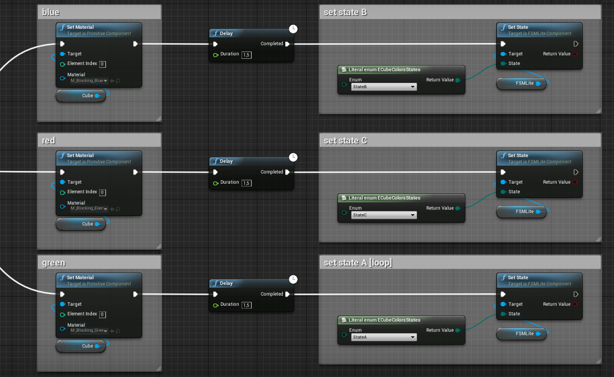

# FSMLite

**FSMLite** is a plugin for UE4 that helps creating Finite State Machines. BP Enum based states. It is designed to be minimalistic and efficient. :rocket:

## Installation
* Copy into 'Plugins' folder in the project's root. Create one if needed.

## Quick start
* Create a BP enum. These values will be the states of the FSM.

* Add a FSMLite Component to a blueprint.

* Call InitFSMLite() with the number of states in the enum and the initial state.

* Right click on the FSMLite component, Add Event, **OnBeginState**. In the same way the **OnTickState** and **OnEndState** events can be added.

* Use SetState() to change state. Here there's just a delay before passing to next state. Transition conditions can be checked every tick using the **OnTickState** event.

